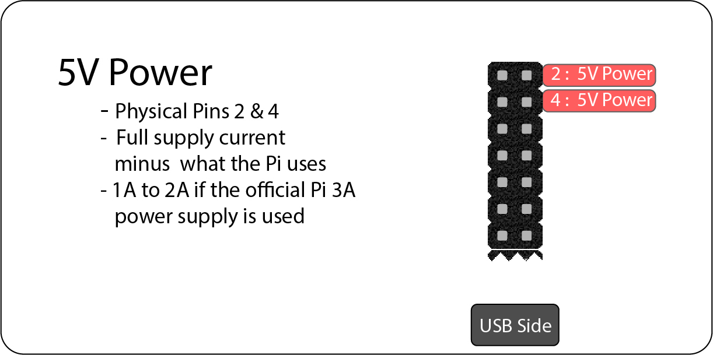

<iframe width="560" height="315" src="https://www.youtube.com/embed/TrnCnbPjTJU" title="YouTube video player" frameborder="0" allow="accelerometer; autoplay; clipboard-write; encrypted-media; gyroscope; picture-in-picture" allowfullscreen></iframe>

# 2. General Purpose Input and Output (GPIO)

The 40-pin GPIO header found on the Pi enables easy access to the CPU pins. The male header pins are spaced 2.54mm (0.1 inches) apart. The pins are bi-directional and are used to make the CPU pins electrically accessible. We will cover most of the pins below.

<b>Fig.1 - Raspberry Pi 4 GPIO</b>

## 2.1 GPIO Naming Conventions

The numbering of the pins can be a bit challenging when working with the GPIO. There are a few methods that you may come across when you are looking at other people's code. We will discuss the two main naming conventions. Check out [Raspberry Pi Pinout](https://pinout.xyz/) for a more detailed description of every pin. 

- **Physical Pins** 
  - The physical pin naming convention uses the physical position of the 40 pin GPIO header.
  - With the **USB ports facing down** the numbering starts at the top left of the GPIO header
  - The odd numbers are on the left
  - The even numbers are on the right
- **Broadcom(BCM) Chip Specific Pins**
  - The BCM pin naming convention is sometimes referred to as the **GPIO** pin numbering
  - The numbers correspond to the pin on the CPU and are not in sequence on the 40 pin GPIO Header
  - The BCM numbering is officially supported by the Raspberry Pi Foundation and will be used in future labs

<b>Fig.2 - GPIO Naming Conventions</b>

### 2.1.1 5V Power

With the **USB ports facing down** the top 2 pins on the right are 5V power (physical pins 2 and 4). This power comes directly from the Pi's power input. The amperage for these pins will max out around 1 to 2 amps if you are using the official pi 3A power supply.

<b>Fig.2 - GPIO Naming Conventions</b>

