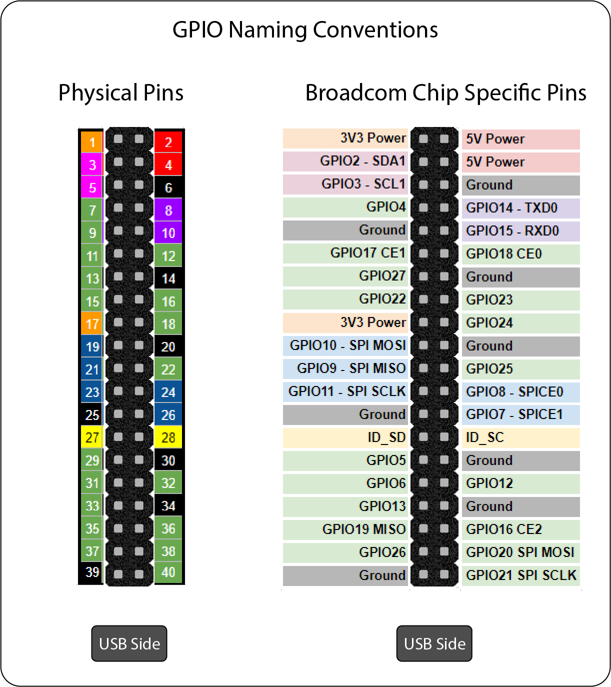
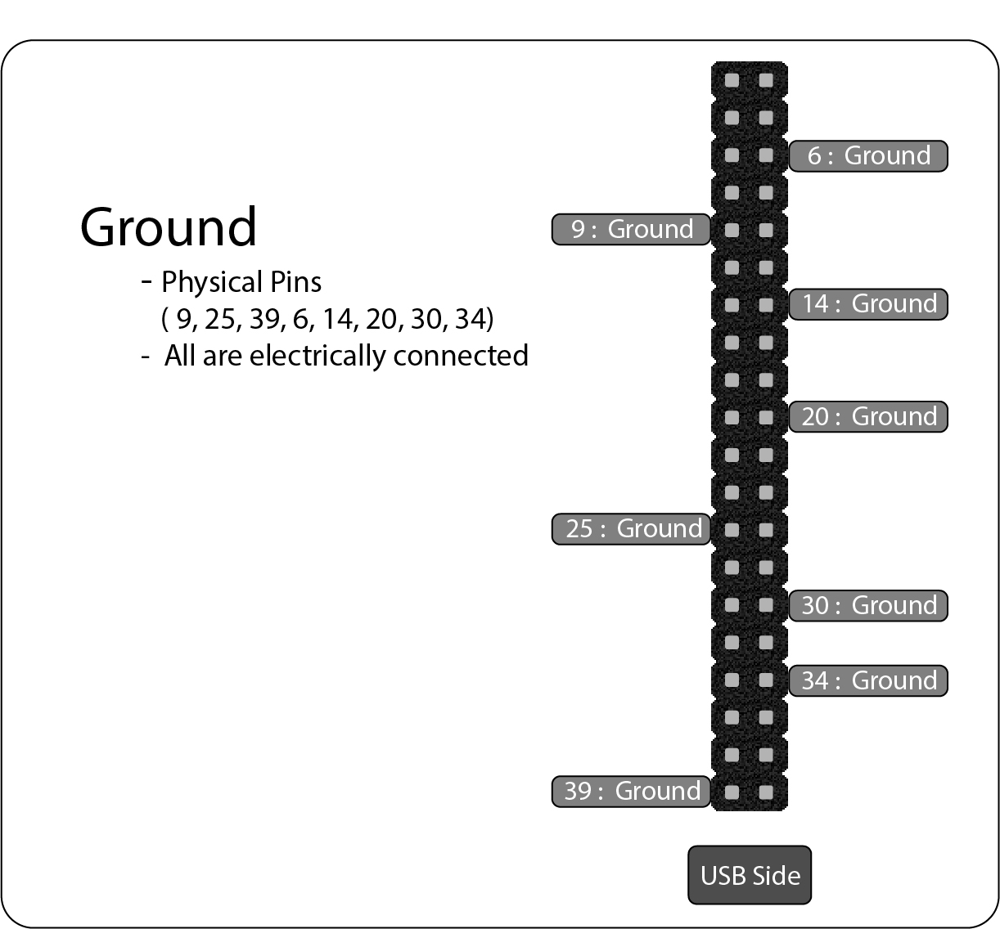
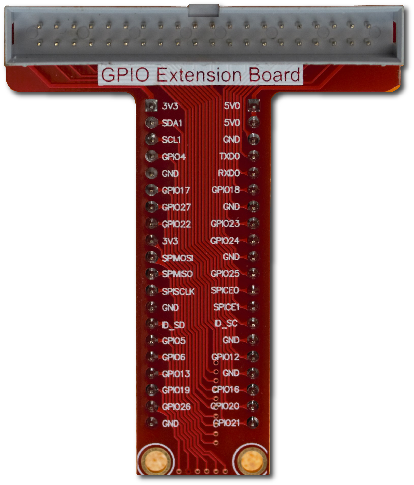

<iframe width="560" height="315" src="https://www.youtube.com/embed/TrnCnbPjTJU" title="YouTube video player" frameborder="0" allow="accelerometer; autoplay; clipboard-write; encrypted-media; gyroscope; picture-in-picture" allowfullscreen></iframe>

# 2. General Purpose Input and Output (GPIO)

The 40-pin GPIO header found on the Pi enables easy access to the CPU pins. The male header pins are spaced 2.54mm (0.1 inches) apart. The pins are bi-directional and are used to make the CPU pins electrically accessible. We will cover most of the pins below.

<b>Fig.1 - Raspberry Pi 4 GPIO</b>

## 2.1. GPIO Naming Conventions

The numbering of the pins can be a bit challenging when working with the GPIO. There are a few methods that you may come across when you are looking at other people's code. We will discuss the two main naming conventions. Check out [Raspberry Pi Pinout](https://pinout.xyz/) for a more detailed description of every pin. 

- **Physical Pins** 
  - The physical pin naming convention uses the physical position of the 40 pin GPIO header.
  - With the **USB ports facing down** the numbering starts at the top left of the GPIO header
  - The odd numbers are on the left
  - The even numbers are on the right
- **Broadcom(BCM) Chip Specific Pins**
  - The BCM pin naming convention is sometimes referred to as the **GPIO** pin numbering
  - The numbers correspond to the pin on the CPU and are not in sequence on the 40 pin GPIO Header
  - The BCM numbering is officially supported by the Raspberry Pi Foundation and will be used in future labs

<b>Fig.2 - GPIO Naming Conventions</b>

### 2.1.1 Power Pins 

#### 2.1.1.1 Power Pins 5V (2 total)
With the **USB ports facing down** the top 2 pins on the right are 5V power (physical pins 2 and 4). The power comes directly from the Pi's power input. The amperage for these pins will max out around 1 to 2 amps if you are using the official pi 3A power supply.

<b>Fig.3 - 5V Power</b>

#### 2.1.1.2 Power Pins 3.3V (2 Total)
Pins 1 and 17 are regulated 3.3V pins. The maximum recommended amperage is 500 mA. [More information about the 3.3V regulated power.](https://raspberrypise.tumblr.com/post/144555785379/exploring-the-33v-power-rail)

<b>Fig.4 - 3.3V Power</b>

### 2.1.2. Ground Pins (8 Total)

With the **USB ports facing down** the ground pins are physical pins ( 9, 25, 39, 6, 14, 20, 30, 34 ). The eight ground pins are all electrically connected. 

<b>Fig.5 - Ground</b>

### 2.1.3. GPIO Pins (17 total)

The GPIO pins are bi-directional. They can be used as an input or an output. An input pin can read a value of HIGH or LOW. An output pin can be turned HIGH or LOW. The GPIOs use 3.3V for both input and output. There are several special purpose pins that will be covered below.

### 2.1.4. PWM GPIO (4 Total)

Four of the GPIO pins can be used for Pulse Width Modulation(PWM). A future lesson will cover PWM.

<b>Fig. 6 PWM GPIO pins</b>

## 2.2. GPIO Extension Board

In order to better utilize the GPIO on the raspberry Pi an extension board can be used. The extension board makes it easier to work with the GPIO pins. A 40 pin ribbon cable connects the GPIO header on the PI to the extension board. The extension board is installed in a breadboard. Breadboards allow for electronic experiments.

<b>Fig 7. GPIO Extension Board

<b>Fig 8. Electronics Breadboard Image by<a href="https://www.flickr.com/photos/adafruit/9357299879/in/photolist-ffSBfx-fg7RLw-EB4ULD-fg7QFh-Tyip8p-e723ue-fpFMY4-5HBB4A-fpFK9X-gK7UW6-bQSggz-fpFLjH-fpW1z3-fpW1QA-fpFJP4-gK7WdW-24gbrk2-KtHWxo-Sjr1Ci-LnHPvC-9mG6JS-5C4yKe-jQMKN3-o3oVmu-jQMHCw-e8wvRq-e7232F-8uLWAD-j6zJeU-8uQ1GC-o3vJRa-dmDFhy-jQMCtJ-gv8tje-jQLacv-e722Xa-o5i1yz-23mMoar-dG2CpZ-j6BKGw-3cixrU-Tjx9qb-eMqfD1-LiMVvz-KZgFhG-uz7nd8-uhim9b-uhiCYL-j6zEAb-nL2t9J"> Adafruit</a></b>

## 2.3. GPIO setup

[The GPIO pins default to input pins on power-on reset.](https://www.raspberrypi.com/documentation/computers/raspberry-pi.html#general-purpose-io-gpio)

Voltage Levels maximum low is [0.14V Min High is 3.0V](https://www.raspberrypi.com/documentation/computers/raspberry-pi.html#gpio-pins)