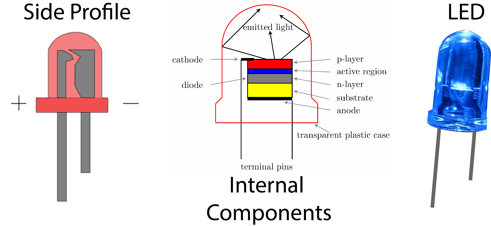
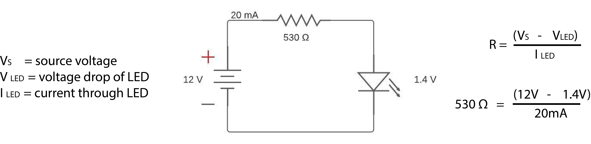

TODO video

# 2. Light Emitting Diode (LED)

An [LED](https://learn.adafruit.com/all-about-leds/what-are-leds-used-for) is an electronic device that illuminates when current passes through it in the "correct direction", also known as a forward-bias. 

When the positive terminal of a battery is applied to the anode (+) and the negative terminal of the battery is applied to the cathode (-), current flows through the LED (forward bias). Voltage applied in the other direction results in no current flow (reverse bias). 

    <b>Fig.2 - Light Emitting Diode Symbol - Image by 
        <a href="https://upload.wikimedia.org/wikipedia/commons/5/52/%2B-_of_LED_2.svg">Adam850, </a>
        <a href="https://creativecommons.org/licenses/by-sa/3.0">J Navas</a>, via Wikimedia Commons
    </b>

## 2.1. Parts of an LED

The anode (+) is typically the longer side of an LED (see Side Profile). The cathode (-) is typically the flat side of an LED (see Top Profile). The schematic symbol for an LED is a diode with arrows representing the light emitting component of an LED (see LED Schematic Symbol)

    <b>Fig.2 - Light Emitting Diode Symbol - Original Image by 
        <a href="https://upload.wikimedia.org/wikipedia/commons/5/52/%2B-_of_LED_2.svg">Adam850</a> 
        via Wikimedia</a>
    </b>

## 2.2. Using an LED in a circuit

An LED needs a forward voltage typically between 1.5 to 4 volts to operate. Exceeding this voltage value will result in an increased amount of current and damage to the LED. In order to ensure that the forward voltage is correct an inline resistor needs to be added to all LED circuits. An [online calculator](https://www.digikey.com/en/resources/conversion-calculators/conversion-calculator-led-series-resistor) can be used to determine the resistance value needed for a specific LED. The figure below shows an example LED circuit

    <b>Fig.3 - An example LED schematic and current limiting resistor calculation
    </b>

## 1.3. Central Processing Unit (CPU)

### 1.3.1. Circuit Traces

## 1.4. Memory and Storage

## 1.5. General Purpose Input Output (GPIO)

## 1.6. Input monitoring with the Pi

## 1.7. Output control with the Pi

## 1.8. Programming Language - Python

## 1.9. Running Programs on the Pi

